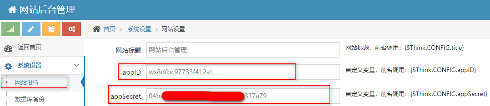

# 可可心形拼图微信小程序后台

可可心形拼图微信小程序源码[https://github.com/smiger/photo-edit](https://github.com/smiger/photo-edit)

# 部署

1. git clone https://github.com/smiger/photo-edit-server.git
2. 上传源码到服务器
3. 新建mysql数据库pic_db，导入源码根目录下的pic_db.sql文件
4. 修改photo-edit-server/App/Common/Conf/config.php，将数据库密码等修改为自己的
5. 访问域名，后台默认登录密码是admin/123456
6. 登录后台修改自己微信公众号的appid和appsecert

